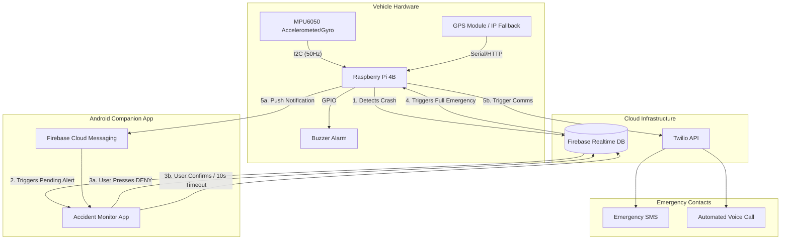

# IoT Accident Detection & Emergency Alert System

An intelligent, IoT-based accident detection system using a Raspberry Pi, an MPU6050 sensor, and Machine Learning. The system detects vehicle crashes, confirms the event via a companion Android app, and automatically dispatches emergency alerts (SMS, Voice Call, and Push Notifications) with the user's live GPS location.

## 🏗️ System Architecture



## ✨ Key Features

- **Dual-Layer Detection:** Hardware threshold detection combined with a Machine Learning model (Gradient Boosting) to eliminate false positives.
- **Android Companion App:** Real-time monitoring, 10-second countdown, and options to manually confirm ("SEND HELP NOW") or deny ("I AM OKAY") the alert.
- **Multi-Channel Emergency Alerts:** If confirmed or timed out, alerts are dispatched simultaneously via:
  - Twilio Voice Call (Text-to-Speech location readout)
  - Twilio SMS (with Google Maps URL)
  - FCM Push Notification (opens Google Maps directly)
- **GPS Fallback System:** Uses a hardware GPS module (gpsd) with an automatic IP-geolocation fallback.

## 📁 Project Structure

```text
.
├── android_app/        # Android companion app source code
├── model/              # ML model training scripts and data
│   ├── crash_model.pkl # Trained Gradient Boosting classifier
│   └── data/           # Raw sensor datasets
├── pi_system/          # Core Raspberry Pi Python application
│   ├── main.py             # Master orchestrator
│   ├── config.py           # Configuration manager
│   ├── mpu6050_driver.py   # Sensor hardware interface
│   ├── firebase_manager.py # Cloud sync logic
│   ├── alert_manager.py    # Twilio/FCM communications
│   └── gps_manager.py      # Location services
├── .env                # Environment variables (Credentials)
└── README.md
```

## 🚀 Setup & Installation

### 1. Raspberry Pi Setup
```bash
# Clone the repository
git clone https://github.com/maneomkar369/Accident-Detection-IoT.git
cd Accident-Detection-IoT

# Install dependencies
pip3 install -r pi_system/requirements.txt
```

### 2. Configuration
1. Rename `.env.example` to `.env` (or create a `.env` file).
2. Fill in your Twilio credentials, Firebase URL, and Emergency Contact numbers.
3. Place your Firebase `google-services.json` in `pi_system/`.

### 3. Run the System
```bash
# Start monitoring
python3 pi_system/main.py

# Simulate a crash for testing
python3 pi_system/main.py --simulate
```
